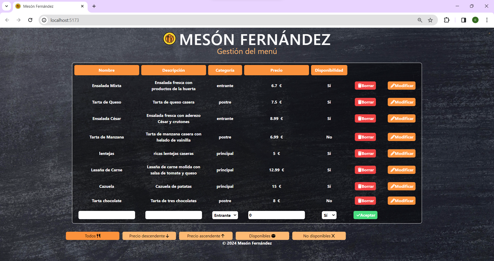
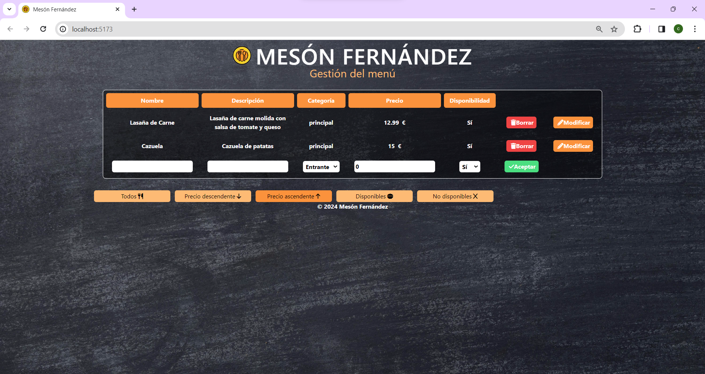
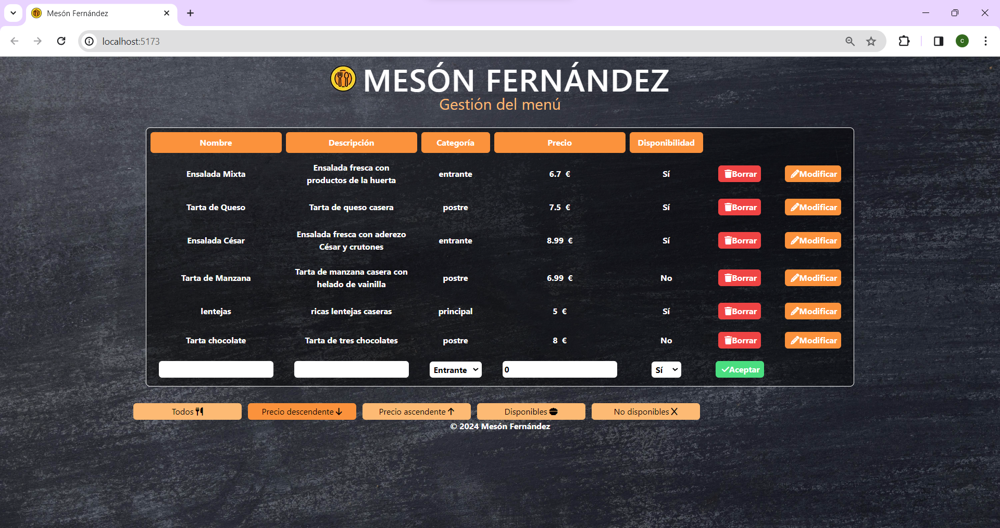
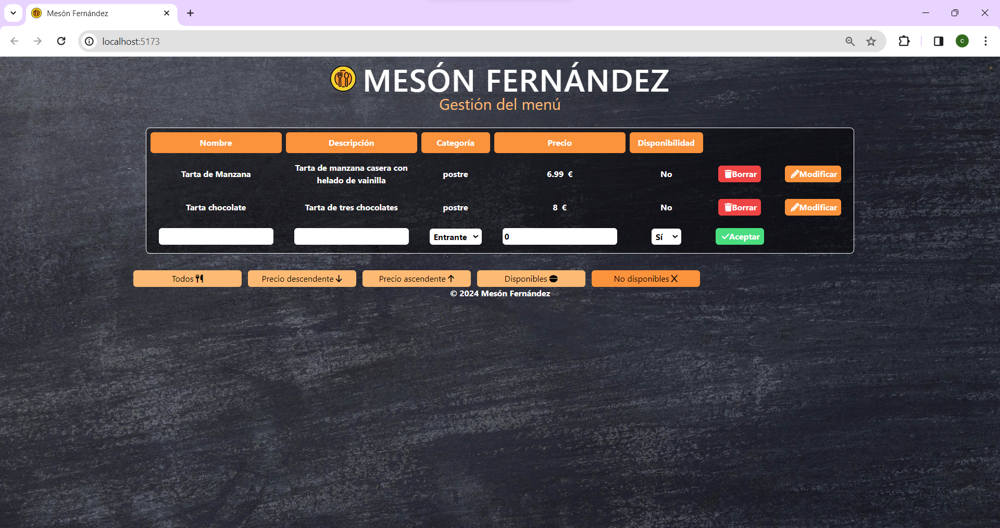
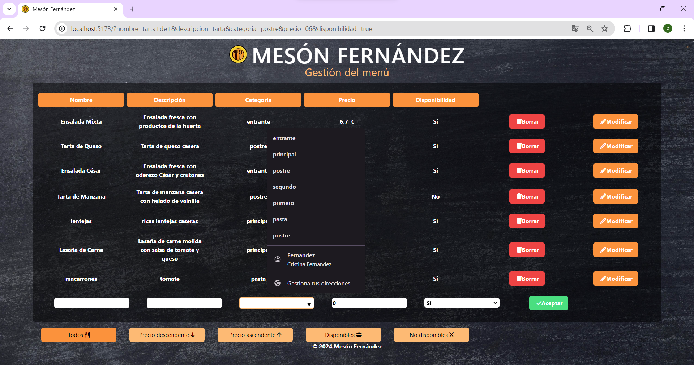

# CRUD de Restaurante en Qwik y Fastapi

Esta es una aplicación de tipo CRUD que permite gestionar información de un restaurante. El frontend está desarrollado en Qwik con los estilos usando tailwind y el backend en FastAPI utilizando MongoDB como base de datos.

## Capturas de pantalla

**Interfaz**: 
Interfaz principal de la aplicación.

**Filtro ascendente**: 
Vista de los platos ordenados de forma ascendente según el precio.

**Filtro descendente**: 
Vista de los platos ordenados de forma descendente según el precio.

**Filtro disponibles**: 
Lista de platos disponibles en el restaurante.

**Filtra no disponibles**: 
Lista de platos que no están disponibles en el restaurante.

**Datalist**: 
Lista de categorias, donde se muestra una lista desplegable (datalist) para seleccionar opciones de forma más rápida, además de poder añadir categoría nueva.

## Tecnologías utilizadas

- Qwik
- Tailwind
- Docker
- Python
- FastAPI
- MongoDB

  

## Enlace al vídeo de demostración

[Video de demostración](https://www.youtube.com/watch?v=_7Dbr5ANSyw)

